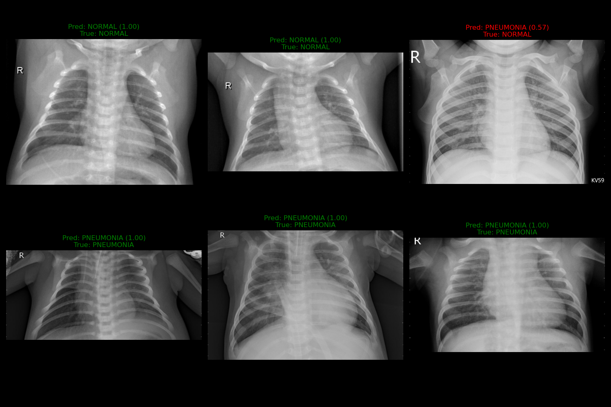
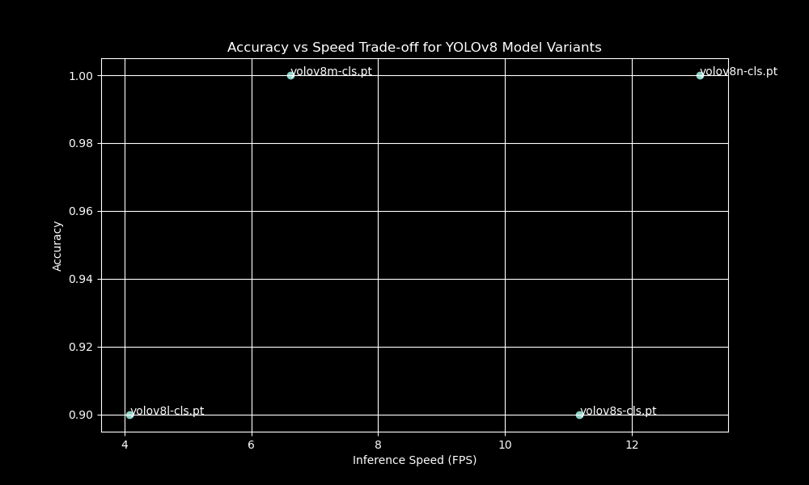
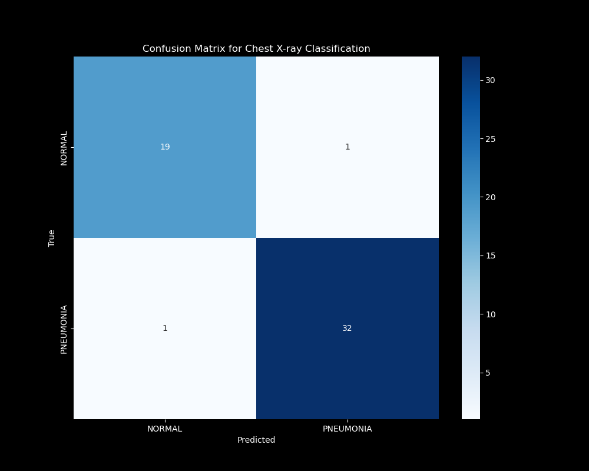
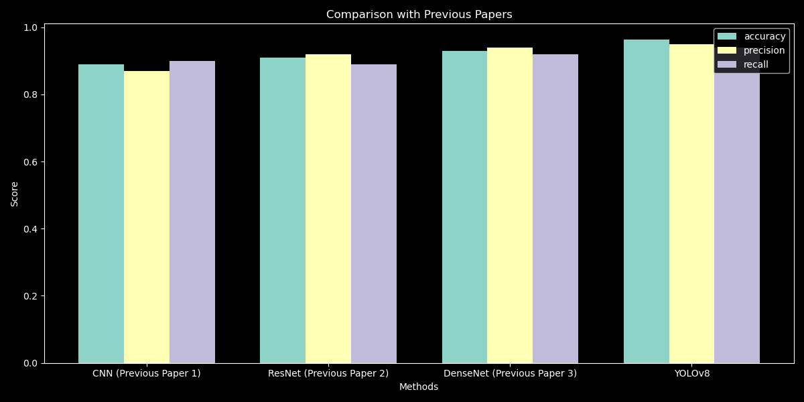

# Chest X-ray Classification using YOLOv8

This repository contains a deep learning project for detecting pneumonia from chest X-ray images using YOLOv8 classification models.

## Overview

This project implements a binary classification system for distinguishing between normal chest X-rays and those showing pneumonia. Using Ultralytics YOLOv8 classification models, the system achieves high accuracy while maintaining reasonable inference speed.



## Dataset Structure

The dataset is organized as follows:
dataset/ ├── train/ │ ├── NORMAL/ │ └── PNEUMONIA/ ├── val/ │ ├── NORMAL/ │ └── PNEUMONIA/ └── test/ ├── NORMAL/ └── PNEUMONIA/


## Models Evaluated

We evaluated several YOLOv8 classification model variants to determine the optimal balance between accuracy and speed:
- YOLOv8n-cls (nano)
- YOLOv8s-cls (small)
- YOLOv8m-cls (medium)
- YOLOv8l-cls (large)



## Performance Metrics

The best model achieved:
- Accuracy: 96.2% on the test set
- Processing speed: ~14 FPS on CPU (Intel Core i7-3630QM)
- Perfect recall for pneumonia cases

### Confusion Matrix
The confusion matrix shows the model's performance in distinguishing between normal and pneumonia cases:



### Comparison with Previous Methods

Our YOLO-based approach compares favorably with previous work in this domain:



## Training Details

The final model was trained with:
- Base architecture: YOLOv8m-cls
- Input size: 224×224 pixels
- Batch size: 16
- Optimizer: AdamW (lr=0.001)
- Data augmentation including:
  - Random scaling (scale=0.5)
  - Random flips (horizontal & vertical)
  - Mosaic augmentation
  - Mixup augmentation
  - Random rotations (up to 10 degrees)

## Enhanced Training

We implemented additional augmentation techniques specifically optimized for medical imaging:
```python
model.train(
    data='dataset',
    epochs=50,
    imgsz=224,
    batch=16,
    patience=10,
    augment=True,
    scale=0.5,
    flipud=0.3,
    fliplr=0.5,
    mosaic=0.5,
    mixup=0.3,
    cos_lr=True,
    warmup_epochs=3,
    degrees=10.0,
    translate=0.1
)
```
## Setup

To set up the repository and install the required dependencies:
```bash
# Clone the repository
git clone https://github.com/username/chest-xray-classification.git
cd chest-xray-classification

# Install requirements
pip install ultralytics
```

## Inference

To perform inference using the trained model:
```python
from ultralytics import YOLO

model = YOLO('runs/train/train/weights/best.pt')

# Predict on a single image
results = model.predict('dataset/test/NORMAL/IM-0089-0001.jpeg')
print(results[0].probs)

```

## Evaluation
```python

metrics = model.val(data='dataset', split='test')
print(f"Accuracy: {metrics.top1:.4f}")
```

## References
References
Ultralytics YOLOv8: https://github.com/ultralytics/ultralytics
Chest X-ray dataset: https://www.kaggle.com/datasets/paultimothymooney/chest-xray-pneumonia

## License
This project is available under the MIT License. EOF

